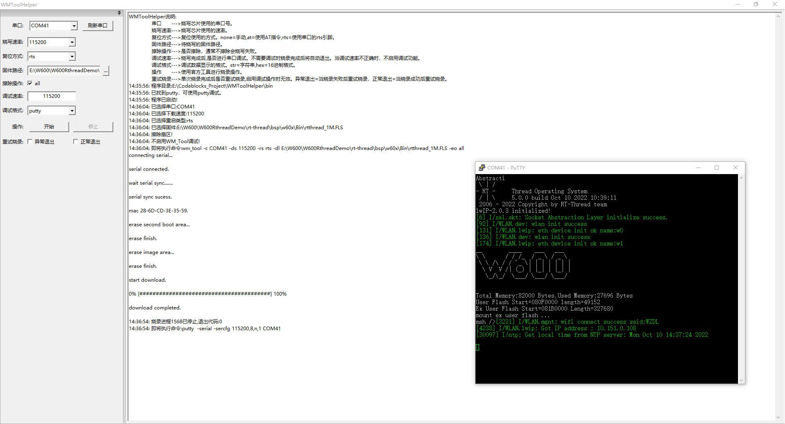

# 说明

W600烧写辅助工具。调用W600官方工具wm_tool完成烧录。

# 注意

非root用户在Linux下使用需要注意串口权限问题，如在ubuntu22.04可使用以下命令解决(修改后重新登陆后生效):

```bash
sudo adduser `id -nu` dialout
```

# 编译

本工具主要支持GCC编译（MSVC编译可能会出现问题）。在Windows下可使用MSYS2的Mingw32或Mingw64环境编译。

## 依赖库

- [wxWidgets](http://wxwidgets.org/)
- [pcre](http://www.pcre.org)


# 截图

